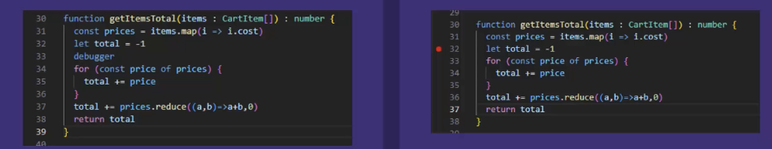
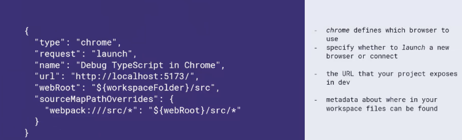

# Debugging
## Understanding the TypeScript Debugging Process
- Key Debugging Concepts
	- Source Maps
		- Associates compiled code with source code
		- Allows readable code to be displayed when inspecting in-browser
		- Generated automatically
- Breakpoint
	- < > a special marker attached to a line of code
	- Does not actually modify code
	- Code will stop running at a breakpoint until resumed

## Advantages
- Source maps help with clearing variable names and indentation, comments, and line numbers
- Documentable Error Resolution (in a team)
	- Define Errors Clearly: Use source map to identify exact file and line where errors occur
	- Explain Steps Taken: Identify code that has been debugged/still needs to be debugged
	- Professional Resolution: Package error description and steps to resolution

## Setup
- tsconfig.json → sourceMap false (which always emits during debugging mode in VScode, but not in Chrome)
	- Generally turned off for productivity

## Debugging w/ Source Maps and Chrome
- Browser runs JS code, not TS code, so source maps connect the JS code running in a browser to TS source code to develop apps

## Breakpoints
- inline/external breakpoints
	
- During a breakpoint, you can: resume execution, step into function, step over function, deactivate breakpoints, step forward, step out of function
- When using chrome, make sure to enable sourceMap to true on tsconfig.json file and chrome settings, in order to see line numbers

## Debugging w/ VSCode Debugger
- Two Major Debugging Environments: Node.js (Terminal) and Web app such as Google Chrome
- Debugging TypeScript Applications in the Terminal  No Browser, full Support, no UI/UX
- Launch.json file needed for debugging to work

- Process
	- Output Source Maps (Using TSConfig)
	- Run Application in dev mode
	- Configure Launch.json, using the application’s dev port
- Run the Debugging process – browser will open automatically

## VSCode Debugging Demo
- Make sure sourceMaps are enabled
- Make sure url and local matches port number
- Continue or F5 (step by step)
- Step Over (line by line)
